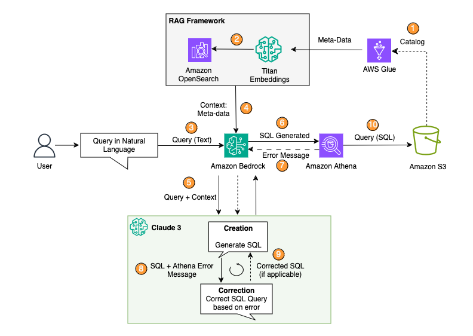

# Natural Language Querying of data in S3 with Athena and Generative AI (Text-to-SQL)

In this sample, you'll see how generative AI can simplify the process of querying and analyzing data stored in Amazon S3 using AWS Athena and the Glue Catalog. Instead of manually writing complex SQL queries, we'll showcase how to describe your analysis requirements in plain English text, and leverage a Generative AI model to generate the corresponding Athena SQL queries.

Athena is an interactive query service that enables analysts to analyze data in S3 using standard SQL. However, constructing SQL queries, especially for complex analysis requirements, can be challenging. This is where the Glue Catalog can help - it stores table definitions and schemas for your data in S3, allowing Athena to query that data seamlessly.

This notebook illustrates how introducing generative AI can bridge the gap. 

1. Overview of text-to-SQL capabilities using GenAI models
2. Utilizing the Glue Catalog table definitions
3. Generating and executing Athena SQL queries from natural language descriptions
4. Using Generative AI for self correcting failed queries
***

# Architecture Overview

Architecture flow:

1. Create the AWS Glue Data Catalog using the AWS SDK or an AWS Glue crawler. (In this example, we will use the [AWS SDK for Pandas Library](https://github.com/awslabs/aws-data-wrangler))

2. Use the Titan-Text-Embeddings model on Amazon Bedrock to convert the metadata into embeddings and store them in a vector store, which serves as our knowledge base in the Retrieval Augmented Generation (RAG) framework. (In this example, we use FAISS as our vector store via Langchain. Alternatively, you can use OpenSearch for a vector database. Learn more about OpenSearch Vector Database Capabilities [here](https://aws.amazon.com/blogs/big-data/amazon-opensearch-services-vector-database-capabilities-explained/))

3. The user enters their query in natural language.

4. Fetch relevant context (relevant tables) from the vector store based on the user's query.

5. Pass the user's query along with the relevant tables (context) to the Claude 3 model to generate a SQL query. This technique of retrieving context and passing it along with the question to the model is called Retrieval Augmented Generation (RAG).

6. Execute the SQL query generated by the model using Amazon Athena.

7. If Athena returns an error message (possibly due to an incorrect SQL query), proceed to the correction loop (Steps 8-9).

8. Pass the error message from Athena and the incorrect SQL query generated to the Large Language Model (LLM) to correct it.

9. The LLM creates the corrected SQL query. This iteration can be performed multiple times if needed.

10. Finally, run the corrected SQL query using Athena and present the output to the user.

[Head over to workshop.ipynb for complete code sample](code/workshop.ipynb)
